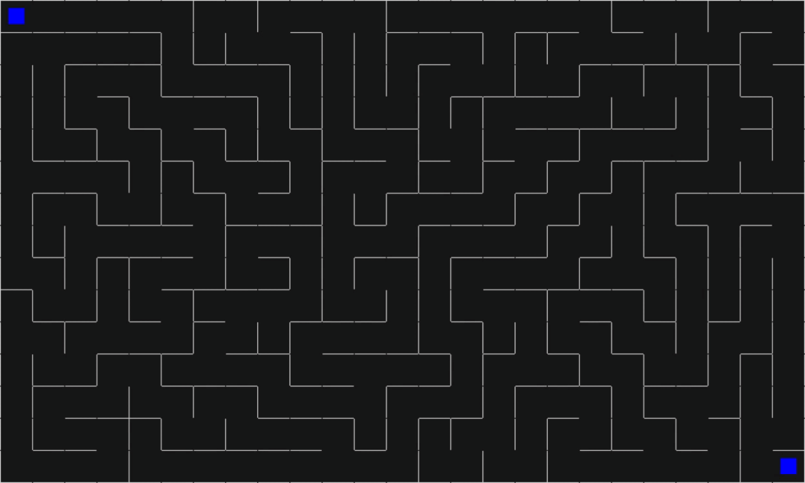

# Labyrinth
> This project is about implementing labyrinth with **C** using **DFS (Depth-first search)** and **BFS (Breadth-first search)** algorithms.

# Screenshots
## Maze generating
- [x] Generating a random maze rusing **Depth-first search (DFS)** algorithm

## Maze solving
- [x] Solving the maze by finding the shortest path using **Breadth-first search (BFS)** algorithm

# SDL instalation
## Linux instalation
- Run the following commands: (for ubuntu)
  - sudo apt update (update packages list)
  - sudo apt install build-essential (install gcc and make)
  - apt-get install libsdl2-dev (install SDL2)
- For other distributions, you can check this [link](https://lazyfoo.net/tutorials/SDL/01_hello_SDL/linux/index.php)
## Windows instalation
- Download and install msys2 from [https://www.msys2.org/](https://www.msys2.org/)
- Open start menu and open the msys2 terminal (**MSYS2 MinGW 64-bit**)
- Run the following commands: (for 64 bit systems)
  - pacman -Syu (update the package database and base packages)
  - pacman -Su (update the rest of the base packages)
  - pacman -S --needed base-devel mingw-w64-x86_64-toolchain (install gcc and make)
  - pacman -S mingw-w64-x86_64-SDL2 (install SDL2)

# Build the project
- [x] Open terminal and go to projet's directory (by typing ***cd project_diretory***)
- [x] Run the command ***make***
- [x] You can also build the project without using make by running the command line ***gcc src/\*.c -o application \`sdl2-config --cflags --libs\`***
